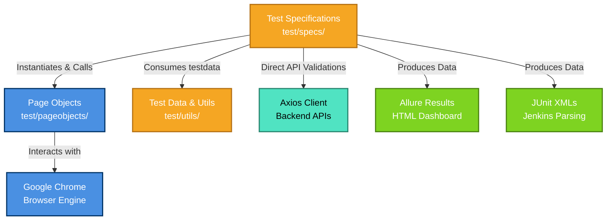

# AIP Sentinel Automation Framework Documentation

## 1. Overview
The **AIP Sentinel Test Automation Framework** is a robust, scalable, and highly maintainable end-to-end framework built leveraging modern automation standards. It is constructed using **WebdriverIO (v9.x)** with **TypeScript**, utilizing the **Mocha** testing framework for a behavior-driven development (BDD) style approach.

The framework supports cross-layer testing, seamlessly combining Frontend UI Automation via WebdriverIO with Backend API validations using `axios` to ensure comprehensive data integrity across the platform.

---

## 2. Architecture & Tech Stack

| Component | Technology / Tool |
|---|---|
| **Core Language** | TypeScript |
| **Test Runner** | WebdriverIO (WDIO) |
| **Test Framework** | Mocha JS |
| **Design Pattern** | Page Object Model (POM) |
| **API Testing** | Axios (HTTP client) |
| **Visual Regression** | `@wdio/visual-service` |
| **Reporting** | Allure Reporter & JUnit |
| **CI/CD** | Jenkins |

---

## 3. Architecture Diagram



---

## 4. Framework Directory Structure

```text
├── .github/                 # GitHub specific rules (e.g., dependabot)
├── TestResults/             # Output artifacts
│   ├── allure-results/      # Raw JSON data for Allure
│   ├── junit/               # JUnit XML reports for Jenkins processing
│   └── logs/                # Framework execution session logs
├── test/
│   ├── pageobjects/         # Page Elements, Selectors, and Action Methods
│   ├── specs/               # E2E Test Scenarios (grouped logically)
│   └── utils/               # Reusable configurations & dynamic test data
├── wdio.conf.ts             # Master WebdriverIO Configuration file
├── package.json             # NPM dependencies & helper scripts
├── Jenkinsfile              # Jenkins CI/CD Pipeline definition
└── run-test.cjs             # Standalone runner and execution wrapper
```

---

## 5. Execution Commands

The framework integrates seamlessly with NPM scripts for easy execution. 

### Prerequisites
- **Node.js** Version `22.18.0` or higher
- **NPM** (Node Package Manager)

### Installation
Run this command once to install all framework dependencies:
```bash
npm install
```

### Running Tests

| Purpose | Execution Command |
|---|---|
| **Run the complete test suite** | `npm run wdio` *(or `npm run test`)* |
| **Run a specific test file** | `npx wdio run ./wdio.conf.ts --spec test/specs/Apps_test.e2e.ts` |
| **Run tests in headless mode (CI)** | Handled automatically in Jenkins or via `--headless=new` flag |

### Generating Reports

| Purpose | Execution Command |
|---|---|
| **Create and open the Allure HTML Report** | `npm run report:allure` |
| **Clear old previous test reports** | `npm run allure:clear` |

---

## 6. Key Features & Workflows

1. **Integrated E2E and API Validations:** Tests like `Apps_test` and `MQ_test` interact with the UI, parse table data, and query APIs simultaneously to ensure the database matches the frontend.
2. **Dynamic Test Data Injection:** Test credentials and logic are maintained in `dynamicTestData.ts` and `testdata.json` keeping test files untainted by hardcoded environment details.
3. **Automated Error Logging:** Whenever a test fails, `wdio.conf.ts` handles auto-capturing screenshots, saving them physically, and directly attaching them into the Allure Report timeline.
4. **Visual Testing:** Powered by `@wdio/visual-service`, capable of pinpointing visual pixel regressions in components like `dashboardpage_test.e2e.ts`.
